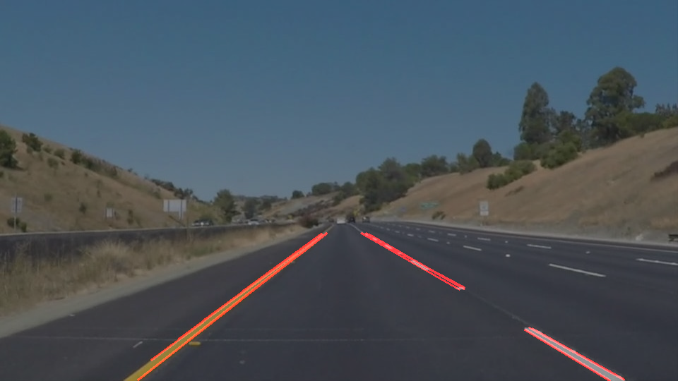
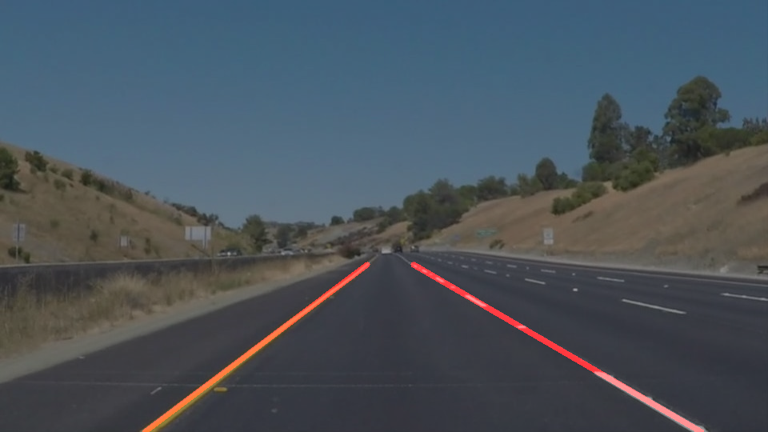

# **Udacity Self-Driving Car Nanodegree**
## **Finding Lane Lines on the Road**


### Goal: Make a pipeline that finds lane lines on the road
### 1. Summary of the Pipeline 
The pipeline to process the images and individual frames consists of the following steps:
- Convert the image to a grayscale
- Apply a gaussian blur
- Apply canny edge detection
- Apply a region of interest mask
- Apply a hough transform
    * The hough transform detects lines on the image
    * These are extrapolated to form two solid lane lines
    * The solid lanes are drawn over the original image

### 2. Pipeline Details
The base image is first converted to **grayscale** using the provided helper function.
```python
gray_img =  grayscale(img)
```

Next, a **gaussian blur** is applied to the image.
```python
kernel_size = 5
blur_img = gaussian_blur(gray_img, kernel_size)
```
The third step of the pipeline is to apply the **canny edge detection**, once again using the provided helper function.
```python
low_threshold = 50
high_threshold = 150
edge_img = canny(blur_img, low_threshold, high_threshold)
```
A **region of interest** mask is applied to the image. The vertices for this region were selected based on the image/video resolution of input. The four points are *(180, image height), (420, 330), (520, 330), (900, image height)*.
```python
bottom_left = (180, img.shape[0])
top_left = (420, 330)
top_right = (520, 330)
bottom_right = (900, img.shape[0])
vertices = np.array([[bottom_left, top_left, top_right, bottom_right]])
mask_img = region_of_interest(edge_img, vertices)
```
Finally, the helper function hough_lines is called to apply the **hough transform** with some fine tuned thresholds.
```python
rho = 1
theta = np.pi/180
threshold = 25
min_line_length = 25
max_line_gap = 60
line_img = hough_lines(mask_img, rho, theta, threshold, min_line_length, max_line_gap)
```
The **weighted_img** method is used overlay the lane lines over the original image.
```python
overlay_img = weighted_img(line_img, img)
```
The input image looks like this.


After processing it through this pipeline (without modifying the **draw_lines** method, it would appear as below.




### 3. Extrapolation of Lane Lines
I have made a few changes to the **draw_lines** method to integrate the line extrapolation. My initial approach was to segregate the lines based on their *x co-ordinate* but that did not yield the desired result.

So, I am now using only the slope to segregate the lines into left and right lanes using the below snippet. Lines with slope close to zero are discarded.
```python
for line in lines:
        for x1,y1,x2,y2 in line:
            slope = round((y2-y1)/(x2-x1))
            if slope > 0:
                right_lane_x.append(x1)
                right_lane_x.append(x2)
                right_lane_y.append(y1)
                right_lane_y.append(y2)
            elif slope < 0:
                left_lane_x.append(x1)
                left_lane_x.append(x2)
                left_lane_y.append(y1)
                left_lane_y.append(y2)
            else:
                #discard
                pass
```

In case, no lines are detected for either the left or right lane on a particular frame, the mean positions from the last 20 frames is used to draw the lane. These values are stored in a **global deque object**.

The **save_global_values** method handles the deque updates.
```python
def save_global_values(left_top, left_bottom, right_top, right_bottom):
```
Example of initialization:
```python
global g_x_left_top
if "g_x_left_top" not in globals():
    g_x_left_top = deque(maxlen=20)
```
Going back to the **draw_lines** method, the below snippet will retrieve the mean from the global dequeu objects when required.
```python
#Verify if lines were detected for the left lane
#Use the mean of the last 20 frames if no lines were detected
if len(left_lane_x) == 0:
    x_left_top = int(round(np.mean(g_x_left_top)))
    x_left_bottom = int(round(np.mean(g_x_left_bottom)))
```
If lines are detected, then the **numpy.polyfit** method is used to obtain the slope and intercept for the lane line and they are in turn used to obtain the points of intersection with the region of interest.
```python
#Use polyfit to obtain the slope and intercept of the entire left lane line
left_lane_const = np.polyfit(left_lane_x, left_lane_y, 1)

#Calculate the x co-ordinates of the left lane at the top and bottom edges
#of the region of interest using the form x = (y - b)/m
x_left_top = int(round((y_top - left_lane_const[1])/left_lane_const[0]))
x_left_bottom = int(round((y_bottom - left_lane_const[1])/left_lane_const[0]))
```
With this modified version of **draw_lines**, the processed image now appears as shown below.



### 4. Shortcomings
This approach works well only with severe restrictions on the input supplied to the pipeline.
These are some of the conditions where the above outlined approach would not work as required:
Input Property | Error Area
-------------- | ----------
Volatile weather and light conditions | The lane lines will not be identified correctly
Roads with sharp curves | The extrapolated lane lines will not be able to fit a curve
A road with a slope or rough terrain | The lane lines may be present out of the region of interest
Other vehicles on the same path or covering the lane lines | Depending on the position, orientation and colour of the vehicle, its edges may be erroneously detected as part of a lane line.
### 5. Possible Improvements
Some of the shortcomings of the above approach can be worked upon by adding a few steps to the pipeline.
* **Dynamic Region of Interest** - It may not be possible to adjust the region of interest perfectly on the fly but by setting it to a proportion of the input image resolution, it should be able to work with different input images.
* **Using HSV instead of RGB** - By converting the image to the HSV scheme, it becomes easier to detect lane lines in adverse lighting conditions (glare, shadows, etc.). This was also the recommended approach for the optional challenge video. By applying a colour mask to focus on yellow and white colours, the accuracy on an HSV image would be significantly higher than an RGB image.
* **Higher degree polynomial** - Using a higher degree polynomial to fit the detected line points, should make it possible to extrapolate a lane line even along a sharp curve.